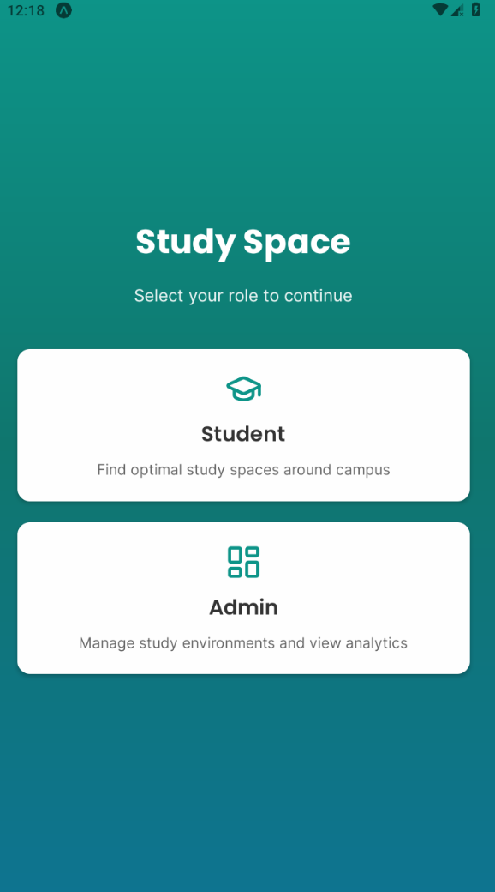
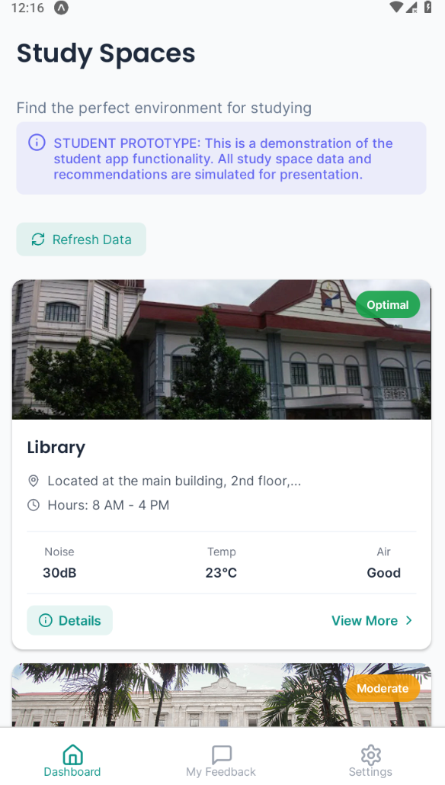
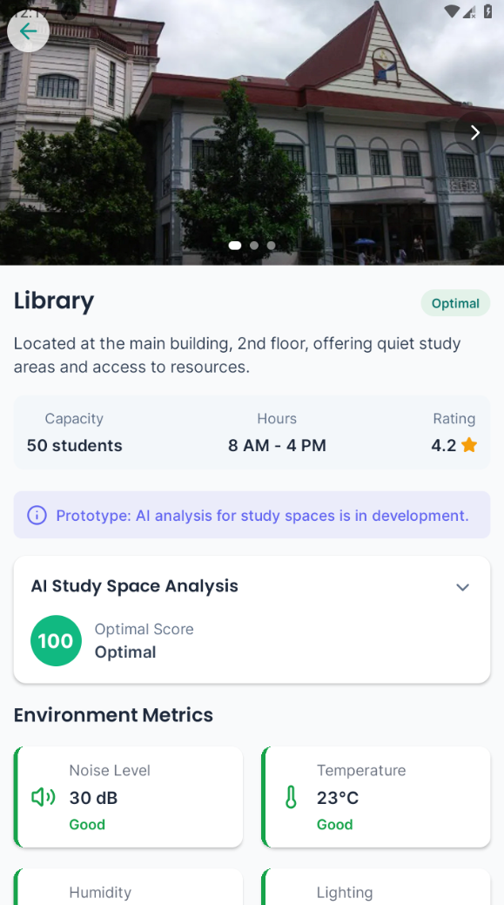
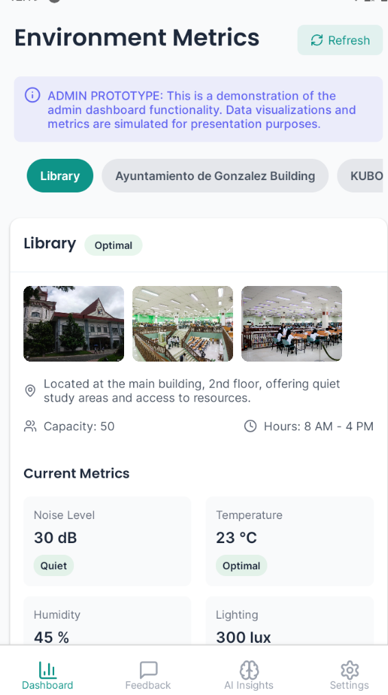

# Study Space


## Overview

Study Space is a mobile application designed to help students find optimal study environments on campus. It monitors and provides real-time data on noise levels, temperature, humidity, lighting, and air quality, creating a comprehensive environment profile for each study location.

The app leverages AI and machine learning to provide personalized recommendations based on collected data and student preferences, enhancing the overall study experience.

## Features

- **Real-time Environment Monitoring**: Track noise levels, temperature, humidity, lighting, and air quality in various study locations
- **Smart Recommendations**: AI-driven suggestions for optimal study locations based on current conditions and past data
- **User Feedback System**: Students can rate and provide feedback on study spaces
- **Admin Dashboard**: Administrators can monitor usage statistics, view feedback, and analyze AI-generated insights
- **Dual User Modes**: Separate interfaces for students and administrators
- **Responsive Design**: Compatible with various mobile devices and screen sizes

## Screenshots




## Technologies Used

- **React Native / Expo**: For cross-platform mobile development
- **TypeScript**: For type-safe code
- **Expo Router**: For navigation and routing
- **React Native Reanimated**: For smooth animations
- **Local Storage**: For data persistence

## Installation

### Prerequisites

- Node.js (v14.0 or higher)
- npm or yarn
- Expo CLI
- Android Studio (for Android development) or Xcode (for iOS development)

### Steps

1. Clone the repository:
   ```bash
   git clone https://github.com/fame2332/StudySpaceThesis.git
   cd StudySpaceThesis
   ```

2. Install dependencies:
   ```bash
   npm install
   # or
   yarn install
   ```

3. Start the development server:
   ```bash
   npx expo start
   ```

4. Run on a device or emulator:
   - Press `a` to run on Android emulator/device
   - Press `i` to run on iOS simulator (macOS only)
   - Use the Expo Go app to scan the QR code for running on a physical device

## Project Structure

```
project-root/
├── app/                  # Main application screens and navigation
│   ├── (admin)/          # Admin-specific screens
│   │   ├── dashboard/    # Admin dashboard screens
│   │   └── login.tsx     # Admin login screen
│   ├── (student)/        # Student-specific screens
│   │   ├── feedback.tsx  # Feedback screen
│   │   └── settings.tsx  # Settings screen
│   ├── role-selection.tsx # Role selection screen
│   └── study-location.tsx # Study location details screen
├── assets/               # Static assets
├── components/           # Reusable UI components
│   ├── admin/            # Admin-specific components
│   └── student/          # Student-specific components
├── utils/                # Utility functions
├── types/                # TypeScript type definitions
└── App.tsx               # Entry point
```

## Usage

### Student Mode

1. Select "Student" on the role selection screen
2. Browse available study locations on the dashboard
3. Tap on a location to view detailed information
4. Check environmental metrics and AI recommendations
5. Provide feedback on the study space

### Admin Mode

1. Select "Admin" on the role selection screen
2. Log in with admin credentials
3. View usage statistics and feedback on the dashboard
4. Check AI-generated insights and recommendations
5. Access settings and configuration options

## Contribution

This project is maintained by:
- Richmond Constante
- Ram Gaerlan
- Amiel Bermillo

## License

This project is licensed under the MIT License - see the [LICENSE](LICENSE) file for details.
This code is only for use by Richmond Constante, Ram Gaerlan, and Amiel Bermillo.

## Contact

For questions or support, please contact:
- Email: [rc202300000@gmail.com](mailto:rc202300000@gmail.com)
- GitHub: [https://github.com/fame2332/StudySpaceThesis](https://github.com/fame2332/StudySpaceThesis) 